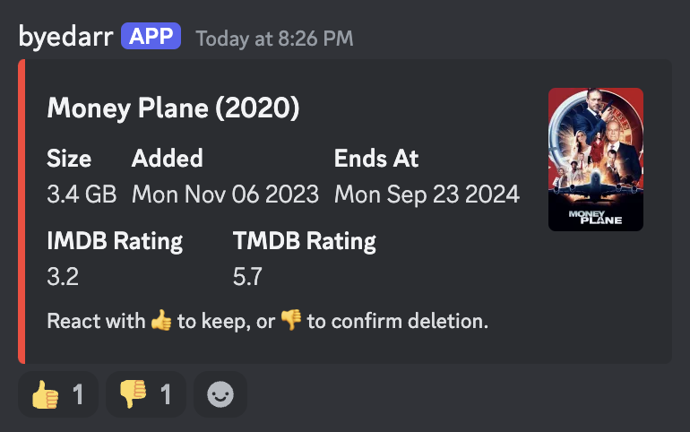

# byedarr

> Community driven media cleanup


## What is it?

**byedarr** is an application which cleans up your media library over time, letting your users vote on which items to keep or to remove.

## How does it work?

1. Connect to your media managers (sonarr/radarr)
2. Connect to your Discord server
3. The bot determines which items to remove, and posts messages to the selected channel:
   
4. After a set time the voting will conclude and the bot will either add the item to a whitelist, or flag it for deletion
5. After the grace period the item will be removed

## Setup

1. Create a Discord bot and get the **bot** token: https://discord.com/developers/applications

2. Create a `.env` file with the following:

```
DISCORD_BOT_TOKEN=<your token>
```

3. Create a `config.yml` file

```yml
mediaManagers:
  - id: "radarr"
    enabled: true
    type: "radarr"
    apiUrl: "http://radarr:7878/radarr"
    apiKey: "xxx"
  - id: "sonarr"
    enabled: true
    type: "sonarr"
    apiUrl: "http://sonarr:8989/sonarr"
    apiKey: "xxx"
votingPeriod: "1 week"
gracePeriod: "1 week"
immunityPeriod: "3 months"
discord:
  channelId: "123456" # Enable Discord developer mode and right-click the channel then press "Copy Channel ID"
```

4. `docker-compose.yml`

```yml
services:
  byedarr:
    image: ghcr.io/benjick/byedarr:latest
    env_file:
      - .env
    environment:
      - DATABASE_URL=postgresql://postgres:postgres@db:5432/postgres
      - CONFIG_PATH=/config/config.yml
    volumes:
      - ./config.yml:/config/config.yml
    restart: unless-stopped

  db:
    image: postgres:16-alpine
    environment:
      - POSTGRES_USER=postgres
      - POSTGRES_PASSWORD=postgres
      - POSTGRES_DB=postgres
    volumes:
      - postgres_data:/var/lib/postgresql/data
    restart: unless-stopped

volumes:
  postgres_data:
```

> ✋ The config is read on app start, so any changes will require a restart.

## Full docs

### Environment variables

| Variable          | Type         | Comment                                                   |
| ----------------- | ------------ | --------------------------------------------------------- |
| DISCORD_BOT_TOKEN | string       | https://discord.com/developers/applications               |
| CONFIG_PATH       | string       | Path to the configuration file, e.g. `/config/config.yml` |
| DATABASE_URL      | string (URL) | PostgreSQL database connection URL                        |
| DRY_RUN           | boolean      | If true, nothing is actually deleted from sonarr/radarr   |
| DEBUG             | boolean      | If true, debug messages are printed to the console        |
| SKIP_MIGRATIONS   | boolean      | If true, migrations are skipped                           |

### `config.yml`

```yaml
cron:
  # How often to check for media to remove (default: daily at 6 PM)
  findMedia: "0 18 * * *"
  # How often to check for ended votes and process results (default: hourly)
  processVotes: "0 * * * *"

# List of media managers to use
mediaManagers:
  - id: "unique_identifier" # Unique identifier for the media manager (don't change later)
    enabled: true # Should look for media in this manager
    apiUrl: "http://radarr:7878/radarr" # Base URL for the media manager's API (excluding '/api')
    apiKey: "xxx"
    type: "radarr" # Specifies the media manager software (radarr or sonarr)
    count: 1 # Number of media items to include in each voting round
    weights: # Weights for each media attribute
      age: 0.1 # Weight based on time since added to the media manager
      size: 0.3 # Weight based on media size
      rating: 1 # Weight based on media rating
    addImportExclusionOnDelete: false # If true, adds deleted items to import exclusion list

# Paths to ignore when processing media
ignoredPaths:
  - "/path/to/ignore"
  - "/another/path"

# Discord settings
discord:
  channelId: "discord_channel_id" # ID of the channel to send messages to

# Voting and grace period settings
votingPeriod: "1 week" # How long a vote lasts
gracePeriod: "2 weeks" # Wait time after vote ends before removing/whitelisting media
immunityPeriod: "3 months" # Time a new media item is immune from voting

# What to do if a vote ends in a draw (keep or delete, default delete)
onDraw: "delete" | "keep"

# If true, no media will actually be deleted from managers
dryRun: false
```
